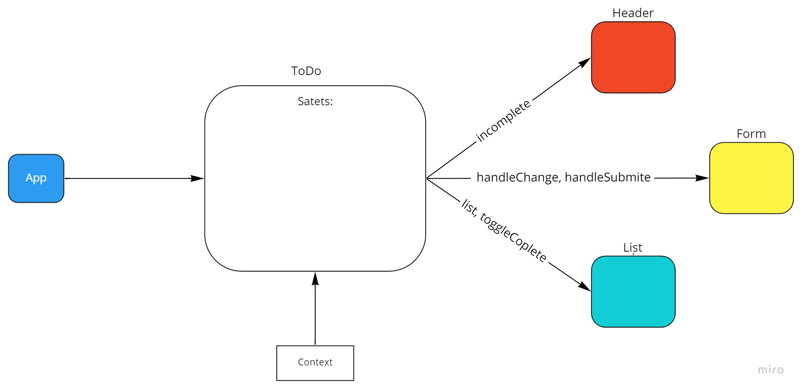

# To Do List Manager

## About

This application was made to solve busy people time management complexities (obviously lies!).

### Author : Rami Zregat

## Phase 1 

## Deploy, Run and Test

- [Pull Request](https://github.com/RamiZregat/todo-app/pull/1)
- [Production](ramizregat-todo-app.netlify.app/)

### Setup

#### Running the app

- `npm start`

### UML:

## Phase 2 

## Deploy, Run and Test

- [Pull Request](https://github.com/RamiZregat/todo-app/pull/9)
- [Production](ramizregat-todo-app.netlify.app/)

### Setup

#### Running the app

- `npm start`

### UML:

